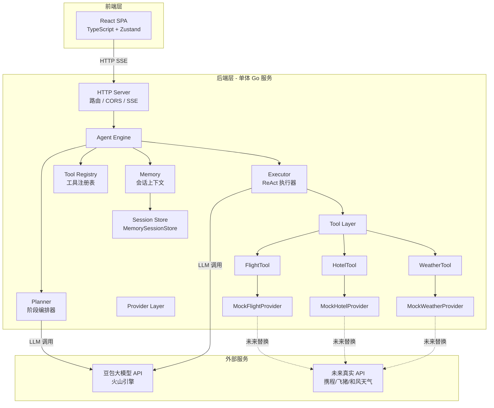
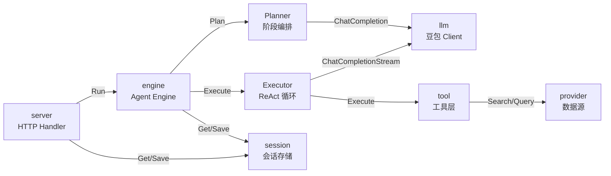
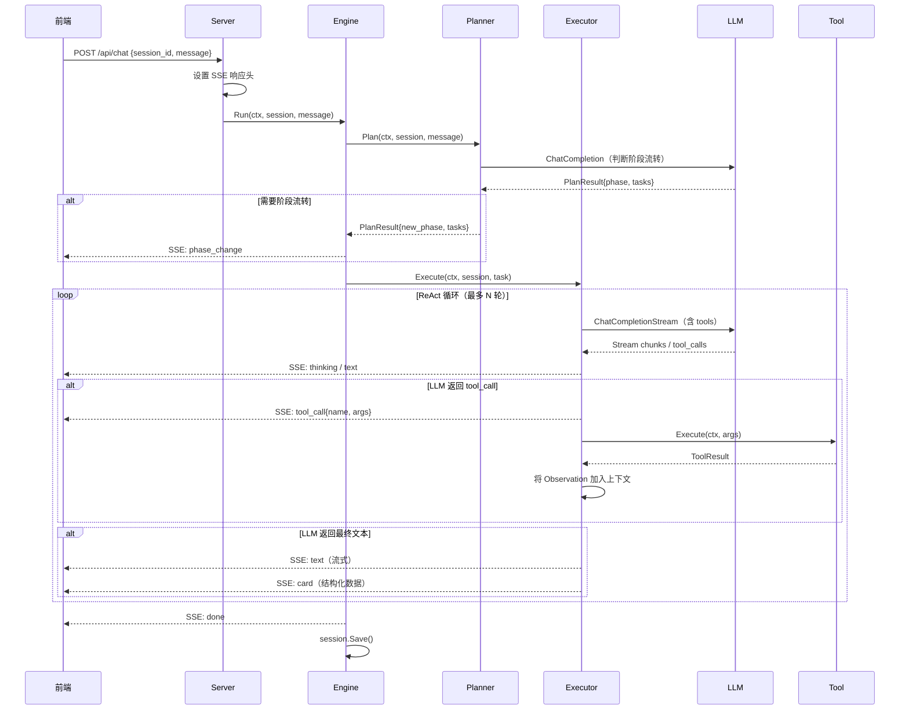
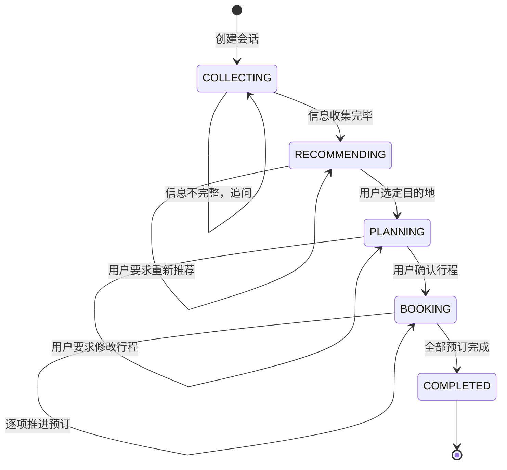
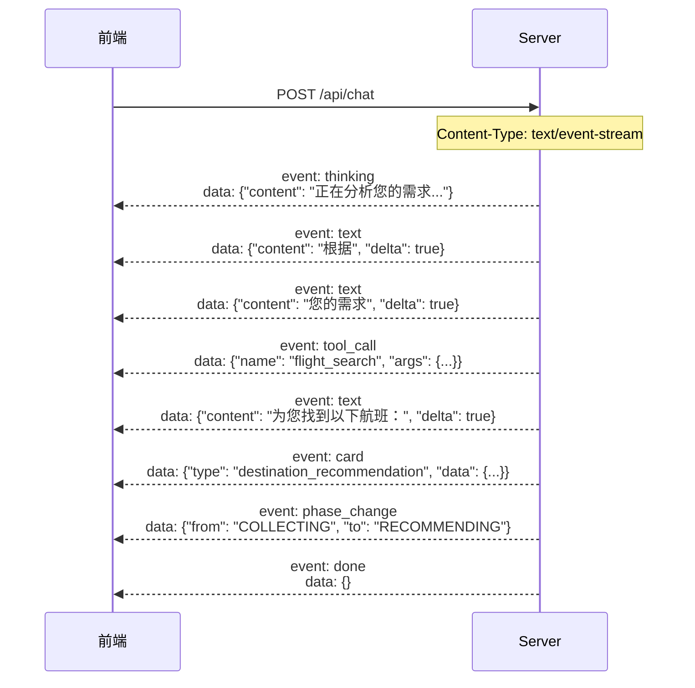
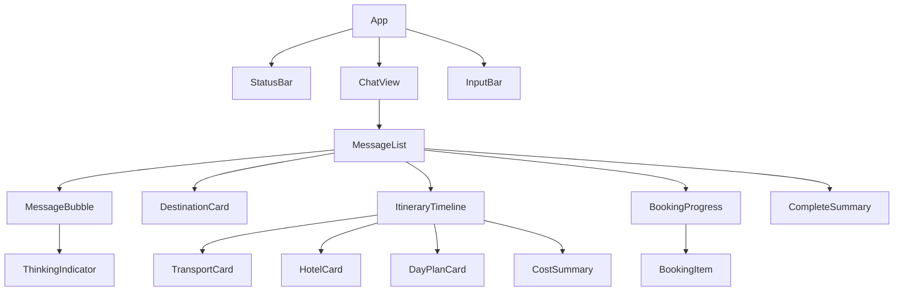

# 架构设计文档 - 旅行规划 Agent

> 本文档描述系统整体架构、模块划分和核心流程设计。详细的数据模型定义和接口协议请参阅 [详细规格文档](./specs.md)。

## 1. 架构概述

### 1.1 系统架构图



### 1.2 架构说明

**架构模式**：单体 Go 服务 + 内嵌 Agent Engine

核心设计决策：

1. **单体服务**：学习性项目，采用单进程部署，避免分布式复杂度。所有模块通过 Go package 组织，进程内直接调用。
2. **Agent 混合模式（Plan-and-Execute + ReAct）**：
   - Planner 负责阶段级编排，维护有限状态机 `COLLECTING → RECOMMENDING → PLANNING → BOOKING → COMPLETED`
   - Executor 在单个阶段内运行 ReAct 循环（Thought → Action → Observation），支持单轮内多工具并行调用
3. **两层工具抽象（Tool + Provider）**：Tool 面向 Agent Engine 暴露统一接口，Provider 面向外部数据源。通过配置切换 Mock/真实实现，新增数据源只需实现 Provider 接口。
4. **前后端分离**：React SPA 通过 HTTP API 与 Go 服务通信，聊天响应使用 SSE 流式传输。
5. **会话存储接口化**：当前使用内存实现，Session 全字段 JSON 可序列化，未来可无缝切换 SQLite/Redis。

**数据流向**：
- **写路径**：用户输入 → HTTP Server → Agent Engine → Planner 判断阶段 → Executor ReAct 循环 → Tool 调用 → SSE 事件流回前端
- **读路径**：前端查询会话状态 → HTTP Server → SessionStore → 返回 Session 快照

### 1.3 Go 项目目录结构

```
travel-agent/
├── cmd/
│   └── server/
│       └── main.go              # 程序入口，启动 HTTP 服务
├── internal/
│   ├── config/
│   │   ├── config.go            # 配置结构体定义与加载
│   │   └── config.yaml          # 配置文件模板
│   ├── server/
│   │   ├── server.go            # HTTP Server 设置
│   │   ├── router.go            # 路由注册
│   │   ├── middleware.go        # CORS、日志、Recovery 中间件
│   │   └── handler/
│   │       ├── chat.go          # POST /api/chat（SSE 流）
│   │       ├── session.go       # 会话 CRUD 接口
│   │       └── health.go        # 健康检查
│   ├── engine/
│   │   ├── engine.go            # Engine 接口实现
│   │   ├── planner.go           # Planner 阶段编排器
│   │   ├── executor.go          # Executor ReAct 执行器
│   │   ├── event.go             # Event 事件类型定义
│   │   └── prompt/
│   │       ├── manager.go       # Prompt 管理器
│   │       ├── system.go        # 通用 System Prompt
│   │       ├── collecting.go    # COLLECTING 阶段 Prompt
│   │       ├── recommending.go  # RECOMMENDING 阶段 Prompt
│   │       ├── planning.go      # PLANNING 阶段 Prompt
│   │       └── booking.go       # BOOKING 阶段 Prompt
│   ├── tool/
│   │   ├── registry.go          # ToolRegistry 实现
│   │   ├── tool.go              # Tool 接口定义
│   │   ├── flight.go            # FlightTool
│   │   ├── hotel.go             # HotelTool
│   │   └── weather.go           # WeatherTool
│   ├── provider/
│   │   ├── provider.go          # Provider 接口定义
│   │   ├── flight_mock.go       # MockFlightProvider
│   │   ├── flight_real.go       # 未来真实航班 Provider（占位）
│   │   ├── hotel_mock.go        # MockHotelProvider
│   │   ├── hotel_real.go        # 未来真实酒店 Provider（占位）
│   │   ├── weather_mock.go      # MockWeatherProvider
│   │   └── weather_real.go      # 未来真实天气 Provider（占位）
│   ├── llm/
│   │   ├── client.go            # LLM 客户端接口
│   │   ├── doubao.go            # 豆包 API 实现
│   │   └── types.go             # LLM 请求/响应类型
│   ├── session/
│   │   ├── store.go             # SessionStore 接口
│   │   ├── memory.go            # MemorySessionStore 实现
│   │   └── model.go             # Session 数据模型
│   └── pkg/
│       ├── errors.go            # 统一错误类型
│       └── logger.go            # 日志封装
├── web/                          # 前端项目（React）
│   ├── src/
│   │   ├── App.tsx
│   │   ├── main.tsx
│   │   ├── components/
│   │   │   ├── ChatView.tsx
│   │   │   ├── MessageBubble.tsx
│   │   │   ├── DestinationCard.tsx
│   │   │   ├── ItineraryTimeline.tsx
│   │   │   ├── BookingProgress.tsx
│   │   │   ├── CompleteSummary.tsx
│   │   │   ├── InputBar.tsx
│   │   │   └── StatusBar.tsx
│   │   ├── hooks/
│   │   │   ├── useSSE.ts
│   │   │   └── useSession.ts
│   │   ├── stores/
│   │   │   └── chatStore.ts
│   │   ├── types/
│   │   │   └── index.ts
│   │   ├── api/
│   │   │   └── client.ts
│   │   └── utils/
│   │       └── sse.ts
│   ├── package.json
│   ├── tsconfig.json
│   └── vite.config.ts
├── config.yaml                   # 运行时配置文件
├── go.mod
├── go.sum
├── Makefile
└── README.md
```

## 2. 后端模块划分

### 2.1 模块总览

| 模块名称 | 职责 | 核心功能 | 依赖模块 |
|----------|------|----------|----------|
| `server` | HTTP 接入层 | 路由注册、SSE 推送、中间件 | `engine`, `session` |
| `engine` | Agent 核心引擎 | 阶段编排、ReAct 执行、事件生成 | `tool`, `llm`, `session` |
| `tool` | 工具层 | 工具注册、工具调用入口 | `provider` |
| `provider` | 数据源适配层 | Mock/真实数据源实现 | 外部 API |
| `llm` | LLM 调用层 | 豆包 API 交互、流式响应处理 | 无 |
| `session` | 会话存储层 | Session CRUD、状态持久化 | 无 |
| `config` | 配置管理 | YAML 配置加载、环境变量覆盖 | 无 |
| `pkg` | 公共工具 | 错误处理、日志 | 无 |

### 2.2 各模块详细说明

**模块：server（HTTP 接入层）**
- 职责描述：处理 HTTP 请求，管理 SSE 连接，提供 RESTful API
- 提供的服务：`POST /api/chat`、`POST /api/session`、`GET /api/session/:id`、`DELETE /api/session/:id`
- 依赖的服务：`engine.Engine`、`session.SessionStore`
- 关键文件：`internal/server/handler/chat.go`、`internal/server/router.go`
- 设计要点：
  - Chat 接口返回 SSE 流，通过 `text/event-stream` Content-Type
  - 使用 `context.Context` 管理请求生命周期，客户端断开时取消处理
  - CORS 配置允许前端开发服务器跨域访问

**模块：engine（Agent 核心引擎）**
- 职责描述：Agent 的核心编排逻辑，协调 Planner 和 Executor
- 提供的服务：`Engine.Run()` 返回事件流 channel
- 依赖的服务：`llm.Client`、`tool.ToolRegistry`、`session.SessionStore`
- 关键文件：`internal/engine/engine.go`、`internal/engine/planner.go`、`internal/engine/executor.go`
- 设计要点：
  - Planner 每次调用 LLM 判断是否需要阶段流转，输出 PlanResult（含目标阶段 + 任务列表）
  - Executor 运行 ReAct 循环，最大迭代次数可配置（默认 10 轮）
  - Event channel 支持 thinking/text/tool_call/card/phase_change/done/error 类型
  - Prompt 按阶段模板化管理，运行时注入会话上下文

**模块：tool（工具层）**
- 职责描述：面向 Agent Engine 的统一工具接口，隔离底层数据源差异
- 提供的服务：`ToolRegistry.Get()`、`Tool.Execute()`
- 依赖的服务：`provider.FlightProvider`、`provider.HotelProvider`、`provider.WeatherProvider`
- 关键文件：`internal/tool/registry.go`、`internal/tool/flight.go`
- 设计要点：
  - Tool 通过 `Parameters()` 返回 JSON Schema，供 LLM Function Calling 使用
  - Tool.Execute 内部调用对应 Provider，处理超时和降级
  - ToolRegistry 在服务启动时一次性注册所有可用 Tool

**模块：provider（数据源适配层）**
- 职责描述：实现具体数据源的查询逻辑，Mock 与真实 API 通过接口多态切换
- 提供的服务：`FlightProvider.Search()`、`HotelProvider.Search()`、`WeatherProvider.Query()`
- 依赖的服务：外部 HTTP API（未来）
- 关键文件：`internal/provider/provider.go`、`internal/provider/flight_mock.go`
- 设计要点：
  - Mock Provider 内置常见城市对的合理场景数据（北京-三亚、北京-厦门等）
  - Mock 响应携带 `is_mock: true` 标记
  - Provider 通过配置文件选择，`config.yaml` 中指定 `provider_type: mock` 或 `provider_type: real`
  - 新增真实 API 只需：实现接口 → 注册到工厂 → 配置切换

**模块：llm（LLM 调用层）**
- 职责描述：封装豆包大模型 API 调用，处理流式响应和 Function Calling
- 提供的服务：`Client.ChatCompletion()`、`Client.ChatCompletionStream()`
- 依赖的服务：火山引擎豆包 API
- 关键文件：`internal/llm/doubao.go`、`internal/llm/types.go`
- 设计要点：
  - 支持流式（stream=true）和非流式两种调用模式
  - Planner 使用非流式调用（需完整 JSON 判断阶段）
  - Executor 的文本生成使用流式调用（逐字推送到前端）
  - Function Calling 通过 tools 参数传入 Tool Schema
  - 请求超时 30 秒，支持重试

**模块：session（会话存储层）**
- 职责描述：管理会话生命周期，提供 CRUD 操作
- 提供的服务：`SessionStore.Get()`、`SessionStore.Save()`、`SessionStore.Delete()`
- 依赖的服务：无
- 关键文件：`internal/session/store.go`、`internal/session/memory.go`
- 设计要点：
  - 接口设计支持未来替换为 SQLite/Redis
  - Session 结构体所有字段可 JSON 序列化
  - MemorySessionStore 使用 `sync.RWMutex` 保证并发安全
  - 每次阶段变更时自动调用 Save

### 2.3 模块交互图



## 3. 核心流程设计

### 3.1 流程：用户发送消息（主流程）

**流程描述**：用户通过前端发送一条消息，后端 Agent Engine 处理后返回 SSE 事件流。



**关键步骤说明**：

1. **SSE 连接建立**：Server 设置 `Content-Type: text/event-stream`，保持连接打开
2. **Planner 阶段判断**：调用 LLM 分析当前会话状态和用户输入，决定是否需要阶段流转。Planner 使用非流式调用，返回结构化 JSON
3. **Executor ReAct 循环**：在当前阶段内，Executor 调用 LLM（带 tools 参数），LLM 可能返回文本或 tool_call。如果是 tool_call，执行工具并将结果作为 Observation 反馈给 LLM，继续循环
4. **SSE 事件推送**：每个中间步骤都通过 SSE 实时推送给前端（thinking、text、tool_call、card 等）
5. **会话持久化**：流程结束后（done 或 error），保存 Session 最新状态

**异常分支处理**：
- **LLM 调用超时（30s）**：返回 SSE error 事件，提示用户稍后重试
- **Tool 调用失败**：触发降级策略，使用 LLM 知识估算，标注"预估数据"
- **客户端断开连接**：通过 context 取消传播，终止所有正在进行的操作
- **ReAct 循环超限（10 轮）**：强制终止，返回已有结果 + 提示信息

### 3.2 流程：阶段流转状态机

**流程描述**：Planner 管理会话阶段的有限状态机。



**阶段说明**：

| 阶段 | Planner 判断条件 | Executor 任务 | 可用 Tool |
|------|-----------------|--------------|-----------|
| COLLECTING | 出行时间/预算/出发地齐全 → 流转 | 提取参数、追问缺失信息 | 无 |
| RECOMMENDING | 用户明确选择目的地 → 流转 | 调用 API 获取数据、生成推荐 | Flight, Hotel, Weather |
| PLANNING | 用户确认行程 → 流转 | 生成详细行程、处理修改 | Flight, Hotel, Weather |
| BOOKING | 全部项目处理完 → 流转 | 生成预订链接、追踪状态 | 无（纯生成） |
| COMPLETED | 终态 | 输出汇总 | 无 |

### 3.3 流程：Tool 调用与降级

**流程描述**：Tool 执行时的超时、重试和降级策略。

```mermaid
flowchart TD
    A[Tool.Execute 被调用] --> B{调用 Provider}
    B -->|成功| C[返回真实数据<br/>is_mock=false]
    B -->|超时 5s| D[等待 2s]
    D --> E{第 1 次重试}
    E -->|成功| C
    E -->|再次超时| F[触发降级]
    B -->|错误| F
    F --> G[返回降级数据<br/>is_mock=true<br/>标注"预估数据"]
```

**降级策略详细说明**：

| 场景 | 超时时间 | 重试次数 | 重试间隔 | 降级行为 |
|------|---------|---------|---------|---------|
| 豆包 LLM 调用 | 30s | 2 次 | 3s | 无降级，返回错误提示用户重试 |
| 票务 Provider 调用 | 5s | 1 次 | 2s | 返回 Mock 数据 + "预估"标记 |
| 酒店 Provider 调用 | 5s | 1 次 | 2s | 返回 Mock 数据 + "预估"标记 |
| 天气 Provider 调用 | 5s | 1 次 | 2s | 返回 Mock 数据 + "预估"标记 |

### 3.4 流程：SSE 事件流

**流程描述**：前端通过 SSE 接收后端推送的实时事件。



## 4. 前端设计

### 4.1 页面/路由结构

本项目为单页应用，不使用路由切换页面，所有内容在一个对话界面中通过消息流展现。

| 路由 | 页面组件 | 功能描述 |
|------|----------|----------|
| `/` | `App` | 唯一页面，包含完整对话式 UI |

### 4.2 组件树



### 4.3 核心组件设计

**App**
- 职责：顶层容器，管理会话生命周期
- State：`sessionId`
- 主要交互：启动时创建 Session，页面关闭时清理

**StatusBar**
- 职责：展示当前阶段状态
- Props：`phase: Phase`、`statusText: string`
- 主要交互：阶段变化时动画过渡

**ChatView**
- 职责：消息列表容器，自动滚动到底部
- Props：`messages: Message[]`
- 主要交互：新消息到达时平滑滚动

**MessageBubble**
- 职责：单条文本消息气泡（用户/Agent）
- Props：`role: 'user' | 'agent'`、`content: string`、`isStreaming: boolean`
- 主要交互：流式文本逐字渲染动画

**DestinationCard**
- 职责：目的地推荐卡片
- Props：`destination: Destination`、`onSelect: (id) => void`
- 主要交互：点击"选择这个"触发选择回调

**ItineraryTimeline**
- 职责：行程时间线展示
- Props：`itinerary: Itinerary`、`onConfirm: () => void`、`onModify: () => void`
- 主要交互：确认/修改按钮

**BookingProgress**
- 职责：预订引导进度展示
- Props：`bookingItems: BookingItem[]`、`onPaid: (id) => void`、`onSkip: (id) => void`
- 主要交互：点击"已支付"/"跳过"按钮

**CompleteSummary**
- 职责：预订完成汇总
- Props：`summary: BookingSummary`
- 主要交互：展示最终状态

**InputBar**
- 职责：用户输入框
- Props：`onSend: (text) => void`、`disabled: boolean`
- 主要交互：回车/点击发送

### 4.4 状态管理

使用 Zustand 管理全局状态：

```typescript
interface ChatStore {
  // 会话状态
  sessionId: string | null;
  phase: Phase;
  
  // 消息列表
  messages: Message[];
  
  // SSE 连接状态
  isConnecting: boolean;
  isStreaming: boolean;
  
  // Actions
  createSession: () => Promise<void>;
  sendMessage: (content: string) => void;
  appendMessage: (message: Message) => void;
  updateStreamingText: (delta: string) => void;
  setPhase: (phase: Phase) => void;
}
```

**消息模型**：支持多内容块混排（文本 + 卡片）

```typescript
interface Message {
  id: string;
  role: 'user' | 'agent';
  blocks: ContentBlock[];
  timestamp: number;
}

type ContentBlock = 
  | { type: 'text'; content: string }
  | { type: 'thinking'; content: string }
  | { type: 'card'; cardType: CardType; data: any }
  | { type: 'tool_call'; name: string; status: 'running' | 'done' };
```

### 4.5 核心 Hooks

**useSSE**
- 职责：管理 SSE 连接，解析事件流
- 输入：`url: string`、`body: object`
- 输出：事件回调（onThinking, onText, onCard, onDone, onError）
- 要点：使用 `fetch` + `ReadableStream` 实现 POST SSE

**useSession**
- 职责：会话创建/查询/销毁
- 输入：无
- 输出：`sessionId`、`createSession()`、`deleteSession()`

### 4.6 API 调用概览

| 接口名称 | 方法 | 路径 | 用途 | 详细定义 |
|----------|------|------|------|----------|
| 发送消息 | POST | /api/chat | 发送用户消息，返回 SSE 流 | 见 specs.md 第 2.3 节 |
| 创建会话 | POST | /api/session | 创建新会话 | 见 specs.md 第 2.3 节 |
| 获取会话 | GET | /api/session/:id | 获取会话状态 | 见 specs.md 第 2.3 节 |
| 删除会话 | DELETE | /api/session/:id | 结束并删除会话 | 见 specs.md 第 2.3 节 |

## 5. 技术选型

| 层级 | 技术 | 版本 | 选型理由 |
|------|------|------|----------|
| 后端语言 | Go | 1.22+ | 高性能、原生并发、编译部署简单 |
| HTTP 框架 | 标准库 net/http + chi | latest | 轻量级，学习成本低，chi 提供路由分组 |
| 前端框架 | React | 18+ | 生态成熟，组件化开发 |
| 前端语言 | TypeScript | 5.x | 类型安全，开发体验好 |
| 状态管理 | Zustand | 4.x | 轻量、简洁，适合中小型项目 |
| 构建工具 | Vite | 5.x | 开发体验极佳，HMR 快 |
| LLM 模型 | 豆包 doubao-seed-2-0-lite | - | 火山引擎提供，支持 Function Calling |
| 配置管理 | YAML + 环境变量 | - | 结构清晰，环境变量覆盖敏感信息 |

## 6. Prompt 管理设计

### 6.1 Prompt 分层结构

```
System Prompt = 基础人设 + 阶段指令 + 上下文注入
```

| 层级 | 内容 | 更新频率 |
|------|------|---------|
| 基础人设 | Agent 角色定义、通用规则、输出格式 | 固定 |
| 阶段指令 | 当前阶段的具体任务和约束 | 随阶段切换 |
| 上下文注入 | 已收集参数、历史推荐、当前行程 | 每轮动态生成 |

### 6.2 Prompt 管理器

```go
type PromptManager struct {
    basePrompt     string              // 基础人设
    phasePrompts   map[Phase]string    // 各阶段指令模板
}

func (pm *PromptManager) BuildSystemPrompt(session *Session) string {
    base := pm.basePrompt
    phasePrompt := pm.phasePrompts[session.Phase]
    context := pm.buildContext(session)
    return base + "\n\n" + phasePrompt + "\n\n" + context
}
```

### 6.3 各阶段 Prompt 概要

- **COLLECTING**：引导用户提供出行时间、预算、偏好、出发城市，缺失时追问
- **RECOMMENDING**：基于收集的信息 + Tool 返回的数据，生成 2-3 个推荐方案，以结构化 JSON 输出
- **PLANNING**：根据选定目的地，编排每日行程，调用 Tool 获取具体班次/酒店/天气
- **BOOKING**：按预订顺序逐项生成预订信息和链接，追踪已订/跳过状态

## 7. 配置管理

### 7.1 配置文件结构（config.yaml）

```yaml
server:
  host: "0.0.0.0"
  port: 8080
  cors_origins:
    - "http://localhost:5173"

llm:
  provider: "doubao"
  api_url: "https://ark.cn-beijing.volces.com/api/v3/chat/completions"
  # api_key 通过环境变量 ARK_API_KEY 注入
  model: "doubao-seed-2-0-lite-260428"
  max_tokens: 4096
  temperature: 0.7
  timeout: 30s
  max_retries: 2
  retry_interval: 3s

engine:
  max_react_iterations: 10
  planner_model: "doubao-seed-2-0-lite-260428"

tools:
  flight:
    provider_type: "mock"  # mock | real
    timeout: 5s
    retry_count: 1
    retry_interval: 2s
  hotel:
    provider_type: "mock"
    timeout: 5s
    retry_count: 1
    retry_interval: 2s
  weather:
    provider_type: "mock"
    timeout: 5s
    retry_count: 1
    retry_interval: 2s

session:
  store_type: "memory"  # memory | sqlite（未来）
  max_sessions: 100
  ttl: 24h

log:
  level: "info"  # debug | info | warn | error
  format: "text"  # text | json
```

### 7.2 环境变量覆盖

| 环境变量 | 对应配置项 | 必须 |
|---------|-----------|------|
| `ARK_API_KEY` | llm.api_key | 是 |
| `SERVER_PORT` | server.port | 否 |
| `LOG_LEVEL` | log.level | 否 |

## 8. 安全设计

### 8.1 API Key 保护
- 豆包 API Key 仅通过环境变量注入，不存储在代码或配置文件中
- `config.yaml` 模板中不包含真实 Key，使用占位符
- `.gitignore` 排除所有 `.env` 文件

### 8.2 输入校验
- 用户消息长度限制：最大 2000 字符
- Session ID 格式校验：UUID v4 格式
- 请求体大小限制：最大 10KB
- 所有 JSON 输入使用结构体绑定 + 校验

### 8.3 安全防护
- **无认证需求**：单人使用，本地运行，无登录系统
- **CORS 限制**：仅允许配置的前端域名
- **无支付信息**：Agent 绝不收集或存储支付相关数据
- **链接安全**：生成的预订链接必须为 HTTPS 协议
- **错误信息脱敏**：对外返回的错误不暴露内部堆栈或配置细节

## 9. 日志与可观测性

### 9.1 日志设计

使用 Go 标准库 `log/slog` 结构化日志：

```go
// 日志级别使用
// DEBUG: LLM 请求/响应原文、Tool 调用详情
// INFO:  请求入口、阶段流转、Tool 调用结果
// WARN:  重试事件、降级触发
// ERROR: 不可恢复错误
```

### 9.2 关键日志点

| 事件 | 级别 | 包含字段 |
|------|------|---------|
| 收到用户消息 | INFO | session_id, message_length |
| 阶段流转 | INFO | session_id, from_phase, to_phase |
| LLM 调用 | DEBUG | session_id, model, token_count |
| Tool 调用开始 | INFO | session_id, tool_name, args |
| Tool 调用成功 | INFO | session_id, tool_name, duration_ms |
| Tool 调用重试 | WARN | session_id, tool_name, retry_count, error |
| 降级触发 | WARN | session_id, tool_name, fallback_type |
| 请求错误 | ERROR | session_id, error_message |

### 9.3 性能度量

在请求处理的关键路径记录耗时：
- 总请求处理时间
- LLM 调用耗时
- 每个 Tool 调用耗时
- Planner 决策耗时

## 10. 错误处理与降级策略

### 10.1 错误分类

| 错误类型 | 处理方式 | 用户感知 |
|---------|---------|---------|
| LLM 网络超时 | 重试 2 次 → 返回 error 事件 | "服务暂时繁忙，请稍后重试" |
| LLM 返回格式异常 | 重试 1 次 → 使用默认行为 | 无感知，内部重试 |
| Tool Provider 超时 | 重试 1 次 → 降级为 Mock | 数据标注"预估" |
| Tool Provider 错误 | 直接降级为 Mock | 数据标注"预估" |
| Session 不存在 | 返回 404 | "会话已过期，请重新开始" |
| 输入校验失败 | 返回 400 | 具体的校验错误信息 |

### 10.2 降级数据标记

Provider 降级时，返回数据统一添加标记：

```go
type ToolResult struct {
    Data      interface{} `json:"data"`
    IsMock    bool        `json:"is_mock"`
    Source    string      `json:"source"`    // "real_api" | "mock" | "fallback"
    Notice    string      `json:"notice"`    // "预估数据，仅供参考"
}
```

前端收到 `is_mock=true` 的数据时，在卡片上展示"预估"角标。

## 11. 性能考量

- **LLM 流式响应**：使用 SSE 实时推送，用户感知延迟仅为首 token 生成时间（通常 1-3 秒）
- **Tool 并行调用**：当 LLM 返回多个 tool_call 时，使用 goroutine 并行执行
- **会话内存占用**：单个 Session 预估 50KB（含完整对话历史），100 个会话约 5MB
- **前端渲染优化**：
  - 流式文本使用 `requestAnimationFrame` 批量更新 DOM
  - 卡片数据完整接收后一次性渲染，避免闪烁
  - 消息列表使用虚拟滚动（消息数 > 100 时启用）

## 12. 文档索引

- 详细数据模型 & 接口协议：请参阅 [`./specs.md`](./specs.md)
- 前端开发任务：请参阅 [`../tasks/frontend.md`](../tasks/frontend.md)
- 后端开发任务：请参阅 [`../tasks/backend.md`](../tasks/backend.md)
- 产品需求文档：请参阅 [`../product/product.md`](../product/product.md)
- 豆包 API 文档：请参阅 [`../doubao.md`](../doubao.md)
