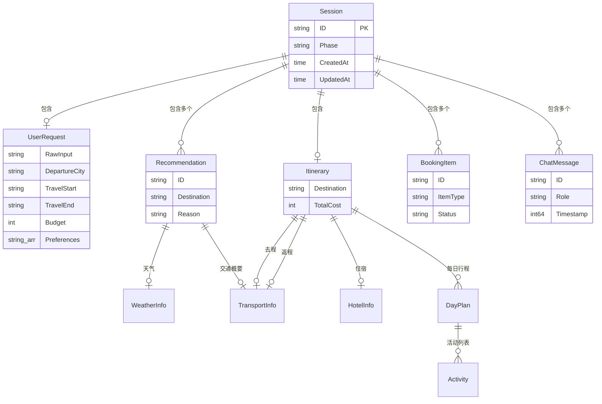

# 详细规格文档 - 旅行规划 Agent

> 本文档包含数据模型定义和接口协议的完整定义，是后续编码实现的直接参考。架构背景请参阅 [架构设计文档](./design.md)。
> 
> 注意：本项目当前不使用传统数据库，数据模型以 Go struct 形式定义，运行时存储在内存中，Session 全字段支持 JSON 序列化以备未来持久化。

## 1. 数据模型定义

### 1.1 模型关系图



### 1.2 Go Struct 完整定义

#### Session（会话根对象）

```go
// Session 旅行规划会话，是整个业务的根聚合对象
type Session struct {
    ID              string           `json:"id"`               // UUID v4，会话唯一标识
    Phase           Phase            `json:"phase"`            // 当前阶段
    CreatedAt       time.Time        `json:"created_at"`       // 创建时间
    UpdatedAt       time.Time        `json:"updated_at"`       // 最后更新时间
    UserRequest     *UserRequest     `json:"user_request"`     // 用户需求（收集阶段填充）
    Recommendations []Recommendation `json:"recommendations"`  // 推荐列表（推荐阶段填充）
    Itinerary       *Itinerary       `json:"itinerary"`        // 确认的行程（规划阶段填充）
    BookingItems    []BookingItem    `json:"booking_items"`    // 预订项列表（预订阶段填充）
    ChatHistory     []ChatMessage    `json:"chat_history"`     // 对话历史
}
```

| 字段 | 类型 | 是否必填 | 说明 |
|------|------|---------|------|
| ID | string | 是 | UUID v4 格式，创建时自动生成 |
| Phase | Phase | 是 | 枚举值，详见 Phase 定义 |
| CreatedAt | time.Time | 是 | RFC3339 格式 |
| UpdatedAt | time.Time | 是 | 每次 Save 时自动更新 |
| UserRequest | *UserRequest | 否 | COLLECTING 阶段逐步填充 |
| Recommendations | []Recommendation | 否 | RECOMMENDING 阶段生成 |
| Itinerary | *Itinerary | 否 | PLANNING 阶段生成 |
| BookingItems | []BookingItem | 否 | BOOKING 阶段生成 |
| ChatHistory | []ChatMessage | 是 | 初始为空数组 |

#### Phase（阶段枚举）

```go
type Phase string

const (
    PhaseCollecting   Phase = "COLLECTING"   // 收集用户需求
    PhaseRecommending Phase = "RECOMMENDING" // 目的地推荐
    PhasePlanning     Phase = "PLANNING"     // 行程规划
    PhaseBooking      Phase = "BOOKING"      // 预订引导
    PhaseCompleted    Phase = "COMPLETED"    // 流程完成
)
```

#### UserRequest（用户需求）

```go
// UserRequest 用户原始需求，在 COLLECTING 阶段由 Agent 逐步解析填充
type UserRequest struct {
    RawInput      string   `json:"raw_input"`      // 用户原始输入文本
    DepartureCity string   `json:"departure_city"` // 出发城市，如"北京"
    TravelStart   string   `json:"travel_start"`   // 出行开始日期，格式 YYYY-MM-DD
    TravelEnd     string   `json:"travel_end"`     // 出行结束日期，格式 YYYY-MM-DD
    Budget        int      `json:"budget"`          // 预算（元），整数
    Preferences   []string `json:"preferences"`     // 偏好标签，如 ["海边", "人少", "潜水"]
    Travelers     int      `json:"travelers"`       // 出行人数，默认 1
}
```

| 字段 | 类型 | 是否必填 | 校验规则 | 说明 |
|------|------|---------|---------|------|
| RawInput | string | 是 | 非空 | 用户原始自然语言输入 |
| DepartureCity | string | 是 | 非空，中文城市名 | 出发城市 |
| TravelStart | string | 是 | YYYY-MM-DD 格式 | 出行开始日期 |
| TravelEnd | string | 是 | YYYY-MM-DD 格式，晚于 TravelStart | 出行结束日期 |
| Budget | int | 是 | > 0 | 预算上限（元） |
| Preferences | []string | 否 | 每项 <= 10 字符 | 偏好标签列表 |
| Travelers | int | 否 | >= 1，默认 1 | 出行人数 |

#### Recommendation（目的地推荐）

```go
// Recommendation 单个目的地推荐方案
type Recommendation struct {
    ID            string        `json:"id"`             // 推荐项 ID，如 "rec_1"
    Destination   string        `json:"destination"`    // 目的地名称
    Reason        string        `json:"reason"`         // 一句话推荐理由
    Weather       WeatherInfo   `json:"weather"`        // 天气概况
    Transport     TransportInfo `json:"transport"`      // 大交通概要
    HotelRange    HotelRange    `json:"hotel_range"`    // 酒店价格范围
    TotalEstimate CostRange     `json:"total_estimate"` // 总费用预估
    SampleTickets []TicketInfo  `json:"sample_tickets"` // 票务示例
    IsMock        bool          `json:"is_mock"`        // 是否为 Mock/预估数据
}
```

#### WeatherInfo（天气信息）

```go
type WeatherInfo struct {
    TempRange string  `json:"temp_range"` // 温度范围，如 "26-32°C"
    Condition string  `json:"condition"`  // 天气状况，如 "晴"、"多云"
    RainProb  float64 `json:"rain_prob"`  // 降水概率，0.0-1.0
    IsMock    bool    `json:"is_mock"`    // 数据是否为预估
}
```

#### TransportInfo（交通信息）

```go
type TransportInfo struct {
    Mode     string `json:"mode"`     // 交通方式：flight | train
    Duration string `json:"duration"` // 预估耗时，如 "3.5h"
    Price    int    `json:"price"`    // 预估价格（元）
    IsMock   bool   `json:"is_mock"`  // 数据是否为预估
}
```

#### HotelRange（酒店价格范围）

```go
type HotelRange struct {
    Economy int  `json:"economy"` // 经济型均价（元/晚）
    Comfort int  `json:"comfort"` // 舒适型均价（元/晚）
    IsMock  bool `json:"is_mock"` // 数据是否为预估
}
```

#### CostRange（费用区间）

```go
type CostRange struct {
    Min int `json:"min"` // 最低预估（元）
    Max int `json:"max"` // 最高预估（元）
}
```

#### TicketInfo（票务示例）

```go
type TicketInfo struct {
    Type     string `json:"type"`      // ticket 类型：flight | train
    Number   string `json:"number"`    // 航班号/车次号，如 "CA1831" 或 "G101"
    Depart   string `json:"depart"`    // 出发时间，格式 HH:mm
    Arrive   string `json:"arrive"`    // 到达时间，格式 HH:mm
    Price    int    `json:"price"`     // 票价（元）
    Seat     string `json:"seat"`      // 舱位/座位等级，如 "经济舱"、"二等座"
    IsMock   bool   `json:"is_mock"`   // 数据是否为预估
}
```

#### Itinerary（行程表）

```go
// Itinerary 完整行程表，PLANNING 阶段生成
type Itinerary struct {
    Destination string       `json:"destination"`  // 目的地
    Outbound    FlightDetail `json:"outbound"`     // 去程交通
    Hotel       HotelDetail  `json:"hotel"`        // 住宿安排
    DailyPlans  []DayPlan    `json:"daily_plans"`  // 每日行程
    Return      FlightDetail `json:"return"`       // 返程交通
    CostSummary CostSummary  `json:"cost_summary"` // 费用汇总
    TotalCost   int          `json:"total_cost"`   // 总费用（元）
}
```

#### FlightDetail（具体交通详情）

```go
type FlightDetail struct {
    Type        string `json:"type"`         // flight | train
    Number      string `json:"number"`       // 航班号/车次号
    DepartCity  string `json:"depart_city"`  // 出发城市
    ArriveCity  string `json:"arrive_city"`  // 到达城市
    DepartTime  string `json:"depart_time"`  // 出发时间 YYYY-MM-DD HH:mm
    ArriveTime  string `json:"arrive_time"`  // 到达时间 YYYY-MM-DD HH:mm
    Duration    string `json:"duration"`     // 耗时
    Price       int    `json:"price"`        // 票价（元）
    Seat        string `json:"seat"`         // 舱位/座位
    IsMock      bool   `json:"is_mock"`      // 是否预估数据
}
```

#### HotelDetail（酒店详情）

```go
type HotelDetail struct {
    Name          string `json:"name"`            // 酒店名称
    Location      string `json:"location"`        // 位置描述
    RoomType      string `json:"room_type"`       // 房型
    CheckIn       string `json:"check_in"`        // 入住日期 YYYY-MM-DD
    CheckOut      string `json:"check_out"`       // 离店日期 YYYY-MM-DD
    Nights        int    `json:"nights"`          // 住宿晚数
    PricePerNight int    `json:"price_per_night"` // 每晚价格（元）
    TotalPrice    int    `json:"total_price"`     // 住宿总价（元）
    IsMock        bool   `json:"is_mock"`         // 是否预估数据
}
```

#### DayPlan（每日行程）

```go
type DayPlan struct {
    Date       string     `json:"date"`       // 日期 YYYY-MM-DD
    DayNumber  int        `json:"day_number"` // 第几天，从 1 开始
    Title      string     `json:"title"`      // 日程标题，如"抵达休整"
    Activities []Activity `json:"activities"` // 活动列表
}
```

#### Activity（活动/景点）

```go
type Activity struct {
    Time      string `json:"time"`      // 时间段，如 "09:00" 或 "09:00-12:00"
    Name      string `json:"name"`      // 活动名称
    Transport string `json:"transport"` // 交通方式（选填）
    Cost      int    `json:"cost"`      // 费用（元），0 表示免费
    Note      string `json:"note"`      // 备注（选填）
}
```

#### CostSummary（费用汇总）

```go
type CostSummary struct {
    OutboundCost  int `json:"outbound_cost"`  // 去程费用
    ReturnCost    int `json:"return_cost"`    // 返程费用
    HotelCost     int `json:"hotel_cost"`     // 住宿费用
    ActivityCost  int `json:"activity_cost"`  // 景点/活动费用
    MealCost      int `json:"meal_cost"`      // 餐饮预估
    TransportCost int `json:"transport_cost"` // 当地交通预估
}
```

#### BookingItem（预订项）

```go
type BookingItem struct {
    ID         string        `json:"id"`          // 预订项 ID
    ItemType   BookingType   `json:"item_type"`   // 类型
    ItemName   string        `json:"item_name"`   // 名称描述
    Detail     string        `json:"detail"`      // 详细信息（如航班号+时间）
    Platform   string        `json:"platform"`    // 预订平台名称
    Link       string        `json:"link"`        // 预订链接（HTTPS）
    AltLinks   []PlatformLink `json:"alt_links"`  // 备选平台链接
    Price      int           `json:"price"`       // 预估价格（元）
    Status     BookingStatus `json:"status"`      // 预订状态
    ActualCost int           `json:"actual_cost"` // 实际花费（用户确认后填入）
    Order      int           `json:"order"`       // 预订顺序（1=最先）
}

type PlatformLink struct {
    Platform string `json:"platform"` // 平台名称
    Link     string `json:"link"`     // 链接地址
}

type BookingType string

const (
    BookingOutbound BookingType = "OUTBOUND" // 去程交通
    BookingHotel    BookingType = "HOTEL"    // 住宿
    BookingReturn   BookingType = "RETURN"   // 返程交通
    BookingTicket   BookingType = "TICKET"   // 景点门票
)

type BookingStatus string

const (
    BookingPending BookingStatus = "PENDING" // 待预订
    BookingBooked  BookingStatus = "BOOKED"  // 已预订
    BookingSkipped BookingStatus = "SKIPPED" // 已跳过
)
```

#### ChatMessage（对话消息）

```go
// ChatMessage 单条对话消息，存储在 Session 的 ChatHistory 中
type ChatMessage struct {
    ID        string         `json:"id"`        // 消息 ID
    Role      string         `json:"role"`      // user | assistant | system
    Content   string         `json:"content"`   // 文本内容
    Blocks    []ContentBlock `json:"blocks"`    // 富内容块（卡片等）
    Timestamp int64          `json:"timestamp"` // Unix 毫秒时间戳
}

// ContentBlock 消息中的内容块
type ContentBlock struct {
    Type     string      `json:"type"`      // text | card | tool_call | thinking
    Content  string      `json:"content"`   // 文本内容（text/thinking 类型使用）
    CardType string      `json:"card_type"` // 卡片类型（card 类型使用）
    Data     interface{} `json:"data"`      // 卡片数据（card 类型使用）
}
```

#### Engine 核心类型

```go
// Event Agent Engine 向外推送的事件
type Event struct {
    Type string      `json:"type"` // thinking | text | tool_call | card | phase_change | done | error
    Data interface{} `json:"data"` // 事件数据，类型取决于 Type
}

// TextEvent 文本事件数据
type TextEvent struct {
    Content string `json:"content"` // 文本内容
    Delta   bool   `json:"delta"`   // true=增量文本，false=完整文本
}

// ThinkingEvent 思考事件数据
type ThinkingEvent struct {
    Content string `json:"content"` // 思考内容
}

// ToolCallEvent 工具调用事件数据
type ToolCallEvent struct {
    Name   string          `json:"name"`   // 工具名称
    Args   json.RawMessage `json:"args"`   // 调用参数
    Status string          `json:"status"` // running | done | error
    Result interface{}     `json:"result"` // 调用结果（Status=done 时）
}

// CardEvent 卡片事件数据
type CardEvent struct {
    CardType string      `json:"card_type"` // 卡片类型
    Data     interface{} `json:"data"`      // 卡片数据（完整 JSON）
}

// PhaseChangeEvent 阶段变更事件数据
type PhaseChangeEvent struct {
    From Phase  `json:"from"` // 原阶段
    To   Phase  `json:"to"`   // 新阶段
}

// ErrorEvent 错误事件数据
type ErrorEvent struct {
    Code    string `json:"code"`    // 错误码
    Message string `json:"message"` // 用户友好的错误信息
}
```

卡片类型枚举：

| CardType | 说明 | Data 结构 |
|----------|------|----------|
| `destination_recommendation` | 目的地推荐卡片 | `[]Recommendation` |
| `itinerary` | 行程表卡片 | `Itinerary` |
| `booking_item` | 单个预订项卡片 | `BookingItem` |
| `booking_summary` | 预订汇总卡片 | `BookingSummary` |

#### BookingSummary（预订汇总）

```go
type BookingSummary struct {
    Destination  string        `json:"destination"`   // 目的地
    Items        []BookingItem `json:"items"`         // 所有预订项
    TotalBooked  int           `json:"total_booked"`  // 已预订总花费
    TotalSkipped int           `json:"total_skipped"` // 跳过项数量
    BookedCount  int           `json:"booked_count"`  // 已预订项数量
}
```

#### Tool 相关类型

```go
// ToolSchema 工具描述，用于 LLM Function Calling
type ToolSchema struct {
    Name        string          `json:"name"`        // 工具名称
    Description string          `json:"description"` // 工具描述
    Parameters  json.RawMessage `json:"parameters"`  // JSON Schema 格式参数描述
}

// ToolResult 工具执行结果
type ToolResult struct {
    Data   interface{} `json:"data"`    // 结果数据
    IsMock bool        `json:"is_mock"` // 是否为 Mock/预估数据
    Source string      `json:"source"`  // 数据来源："real_api" | "mock" | "fallback"
    Notice string      `json:"notice"`  // 提示信息，如"预估数据，仅供参考"
    Error  string      `json:"error"`   // 错误信息（失败时）
}
```

#### Provider 接口定义

```go
// FlightProvider 航班/火车查询 Provider
type FlightProvider interface {
    Search(ctx context.Context, req FlightSearchRequest) (*FlightSearchResult, error)
}

type FlightSearchRequest struct {
    DepartCity string `json:"depart_city"` // 出发城市
    ArriveCity string `json:"arrive_city"` // 到达城市
    Date       string `json:"date"`        // 出发日期 YYYY-MM-DD
    Type       string `json:"type"`        // flight | train | any
}

type FlightSearchResult struct {
    Tickets []TicketInfo `json:"tickets"` // 票务列表
    IsMock  bool         `json:"is_mock"` // 是否 Mock 数据
}

// HotelProvider 酒店查询 Provider
type HotelProvider interface {
    Search(ctx context.Context, req HotelSearchRequest) (*HotelSearchResult, error)
}

type HotelSearchRequest struct {
    City     string `json:"city"`      // 城市
    CheckIn  string `json:"check_in"`  // 入住日期 YYYY-MM-DD
    CheckOut string `json:"check_out"` // 离店日期 YYYY-MM-DD
    Level    string `json:"level"`     // 档次：economy | comfort | luxury
}

type HotelSearchResult struct {
    Hotels []HotelInfo `json:"hotels"` // 酒店列表
    IsMock bool        `json:"is_mock"`
}

type HotelInfo struct {
    Name          string `json:"name"`
    Location      string `json:"location"`
    Level         string `json:"level"`
    PricePerNight int    `json:"price_per_night"`
    Rating        float64 `json:"rating"`
    RoomTypes     []string `json:"room_types"`
}

// WeatherProvider 天气查询 Provider
type WeatherProvider interface {
    Query(ctx context.Context, req WeatherQueryRequest) (*WeatherQueryResult, error)
}

type WeatherQueryRequest struct {
    City      string `json:"city"`       // 城市
    StartDate string `json:"start_date"` // 开始日期 YYYY-MM-DD
    EndDate   string `json:"end_date"`   // 结束日期 YYYY-MM-DD
}

type WeatherQueryResult struct {
    City    string        `json:"city"`
    Daily   []DailyWeather `json:"daily"`
    Summary WeatherInfo   `json:"summary"` // 汇总概况
    IsMock  bool          `json:"is_mock"`
}

type DailyWeather struct {
    Date      string  `json:"date"`
    TempHigh  int     `json:"temp_high"`
    TempLow   int     `json:"temp_low"`
    Condition string  `json:"condition"`
    RainProb  float64 `json:"rain_prob"`
}
```

### 1.3 LLM 调用相关类型

```go
// LLM Client 接口
type LLMClient interface {
    // ChatCompletion 非流式调用，返回完整响应
    ChatCompletion(ctx context.Context, req ChatRequest) (*ChatResponse, error)
    // ChatCompletionStream 流式调用，返回 chunk channel
    ChatCompletionStream(ctx context.Context, req ChatRequest) (<-chan StreamChunk, error)
}

// ChatRequest LLM 请求
type ChatRequest struct {
    Model       string        `json:"model"`
    Messages    []LLMMessage  `json:"messages"`
    Tools       []ToolSchema  `json:"tools,omitempty"`
    Stream      bool          `json:"stream"`
    MaxTokens   int           `json:"max_tokens,omitempty"`
    Temperature float64       `json:"temperature,omitempty"`
}

// LLMMessage 消息
type LLMMessage struct {
    Role             string     `json:"role"`                        // system | user | assistant | tool
    Content          string     `json:"content"`                     // 文本内容
    ReasoningContent string     `json:"reasoning_content,omitempty"` // 思维链（豆包支持）
    ToolCalls        []ToolCall `json:"tool_calls,omitempty"`        // 工具调用
    ToolCallID       string     `json:"tool_call_id,omitempty"`      // 工具调用 ID（role=tool 时）
}

// ToolCall 工具调用
type ToolCall struct {
    ID       string       `json:"id"`
    Type     string       `json:"type"`     // "function"
    Function FunctionCall `json:"function"`
}

type FunctionCall struct {
    Name      string `json:"name"`
    Arguments string `json:"arguments"` // JSON 字符串
}

// ChatResponse 非流式响应
type ChatResponse struct {
    ID      string    `json:"id"`
    Choices []Choice  `json:"choices"`
    Usage   Usage     `json:"usage"`
}

type Choice struct {
    Index        int        `json:"index"`
    Message      LLMMessage `json:"message"`
    FinishReason string     `json:"finish_reason"` // stop | tool_calls
}

type Usage struct {
    PromptTokens     int `json:"prompt_tokens"`
    CompletionTokens int `json:"completion_tokens"`
    TotalTokens      int `json:"total_tokens"`
}

// StreamChunk 流式响应块
type StreamChunk struct {
    ID      string        `json:"id"`
    Choices []StreamChoice `json:"choices"`
}

type StreamChoice struct {
    Index        int         `json:"index"`
    Delta        DeltaMessage `json:"delta"`
    FinishReason *string     `json:"finish_reason"`
}

type DeltaMessage struct {
    Role             string     `json:"role,omitempty"`
    Content          string     `json:"content,omitempty"`
    ReasoningContent string     `json:"reasoning_content,omitempty"`
    ToolCalls        []ToolCall `json:"tool_calls,omitempty"`
}
```

## 2. 接口协议

### 2.1 接口规范说明

- **基础路径**：`/api`
- **请求格式**：`application/json`
- **响应格式**：`application/json`（普通接口）/ `text/event-stream`（Chat 接口）
- **无认证**：本项目单人使用，无需认证
- **通用响应结构**（非 SSE 接口）：

```json
{
  "code": 0,
  "message": "success",
  "data": {}
}
```

### 2.2 错误码定义

| 错误码 | HTTP 状态码 | 含义 |
|--------|-----------|------|
| 0 | 200 | 成功 |
| 10001 | 400 | 请求参数校验失败 |
| 10002 | 404 | 会话不存在 |
| 10003 | 422 | 消息内容为空或过长 |
| 20001 | 500 | 服务器内部错误 |
| 20002 | 503 | LLM 服务不可用 |

**错误响应结构**：

```json
{
  "code": 10001,
  "message": "session_id is required",
  "data": null
}
```

### 2.3 接口详细定义

---

#### 接口：创建会话

**方法**：POST  
**路径**：`/api/session`  
**描述**：创建一个新的旅行规划会话，返回会话 ID

**请求参数**：无请求体（空 body 或 `{}`）

**成功响应（200）**：

| 字段名 | 类型 | 含义 | 示例 |
|--------|------|------|------|
| code | int | 状态码 | 0 |
| message | string | 提示信息 | "success" |
| data.session_id | string | 新会话 ID（UUID v4） | "a1b2c3d4-e5f6-7890-abcd-ef1234567890" |
| data.phase | string | 初始阶段 | "COLLECTING" |
| data.created_at | string | 创建时间（RFC3339） | "2026-05-17T10:00:00Z" |

**响应示例**：

```json
{
  "code": 0,
  "message": "success",
  "data": {
    "session_id": "a1b2c3d4-e5f6-7890-abcd-ef1234567890",
    "phase": "COLLECTING",
    "created_at": "2026-05-17T10:00:00Z"
  }
}
```

---

#### 接口：获取会话状态

**方法**：GET  
**路径**：`/api/session/:id`  
**描述**：获取指定会话的完整状态快照

**路径参数**：

| 参数名 | 类型 | 是否必填 | 校验规则 | 说明 |
|--------|------|---------|---------|------|
| id | string | 是 | UUID v4 格式 | 会话 ID |

**成功响应（200）**：

| 字段名 | 类型 | 含义 |
|--------|------|------|
| code | int | 0 |
| message | string | "success" |
| data | Session | 完整 Session 对象（见数据模型 Session 定义） |

**响应示例**：

```json
{
  "code": 0,
  "message": "success",
  "data": {
    "id": "a1b2c3d4-e5f6-7890-abcd-ef1234567890",
    "phase": "RECOMMENDING",
    "created_at": "2026-05-17T10:00:00Z",
    "updated_at": "2026-05-17T10:05:00Z",
    "user_request": {
      "raw_input": "五一假期想去海边玩，预算5000左右，从北京出发",
      "departure_city": "北京",
      "travel_start": "2026-05-01",
      "travel_end": "2026-05-05",
      "budget": 5000,
      "preferences": ["海边", "人少"],
      "travelers": 1
    },
    "recommendations": [],
    "itinerary": null,
    "booking_items": [],
    "chat_history": []
  }
}
```

**错误响应（404）**：

```json
{
  "code": 10002,
  "message": "session not found",
  "data": null
}
```

---

#### 接口：删除会话

**方法**：DELETE  
**路径**：`/api/session/:id`  
**描述**：删除指定会话

**路径参数**：

| 参数名 | 类型 | 是否必填 | 校验规则 | 说明 |
|--------|------|---------|---------|------|
| id | string | 是 | UUID v4 格式 | 会话 ID |

**成功响应（200）**：

```json
{
  "code": 0,
  "message": "session deleted",
  "data": null
}
```

**错误响应（404）**：

```json
{
  "code": 10002,
  "message": "session not found",
  "data": null
}
```

---

#### 接口：发送消息（SSE 流）

**方法**：POST  
**路径**：`/api/chat`  
**描述**：发送用户消息到 Agent，返回 SSE 事件流。这是最核心的接口。

**请求头**：

| Header | 值 |
|--------|---|
| Content-Type | application/json |
| Accept | text/event-stream |

**请求参数**：

| 参数名 | 类型 | 是否必填 | 校验规则 | 说明 | 示例 |
|--------|------|---------|---------|------|------|
| session_id | string | 是 | UUID v4 格式 | 会话 ID | "a1b2c3d4-..." |
| message | string | 是 | 1-2000 字符，非空白 | 用户消息内容 | "五一想去海边" |

**请求示例**：

```json
{
  "session_id": "a1b2c3d4-e5f6-7890-abcd-ef1234567890",
  "message": "五一假期想去海边玩，预算5000左右，从北京出发"
}
```

**响应**：SSE 事件流（`Content-Type: text/event-stream`）

SSE 事件格式遵循标准 SSE 协议：

```
event: <事件类型>
data: <JSON 数据>

```

**SSE 事件类型详细定义**：

##### event: thinking

Agent 正在思考的过程文本。

```
event: thinking
data: {"content": "用户想要五一去海边，预算5000，需要收集出发地信息..."}
```

| 字段 | 类型 | 说明 |
|------|------|------|
| content | string | 思考过程文本 |

##### event: text

Agent 输出的回复文本，支持增量（delta）推送。

```
event: text
data: {"content": "根据", "delta": true}
```

```
event: text
data: {"content": "您的需求，我为您找到了以下目的地推荐：", "delta": true}
```

| 字段 | 类型 | 说明 |
|------|------|------|
| content | string | 文本内容 |
| delta | bool | true=增量文本（追加），false=完整文本（替换） |

##### event: tool_call

Agent 调用工具的通知。

```
event: tool_call
data: {"name": "flight_search", "args": {"depart_city": "北京", "arrive_city": "三亚", "date": "2026-05-01"}, "status": "running", "result": null}
```

```
event: tool_call
data: {"name": "flight_search", "args": {}, "status": "done", "result": {"tickets": [...]}}
```

| 字段 | 类型 | 说明 |
|------|------|------|
| name | string | 工具名称：flight_search / hotel_search / weather_query |
| args | object | 调用参数 |
| status | string | running / done / error |
| result | object/null | 调用结果（status=done 时） |

##### event: card

结构化卡片数据，前端收到后完整渲染。

```
event: card
data: {"card_type": "destination_recommendation", "data": [{"id": "rec_1", "destination": "三亚", ...}]}
```

| 字段 | 类型 | 说明 |
|------|------|------|
| card_type | string | 卡片类型（见卡片类型枚举） |
| data | object | 卡片完整数据 |

##### event: phase_change

会话阶段变更通知。

```
event: phase_change
data: {"from": "COLLECTING", "to": "RECOMMENDING"}
```

| 字段 | 类型 | 说明 |
|------|------|------|
| from | string | 原阶段 |
| to | string | 新阶段 |

##### event: done

本轮对话处理完成。

```
event: done
data: {}
```

##### event: error

处理过程中发生错误。

```
event: error
data: {"code": "20002", "message": "AI 服务暂时不可用，请稍后重试"}
```

| 字段 | 类型 | 说明 |
|------|------|------|
| code | string | 错误码 |
| message | string | 用户友好的错误信息 |

**完整 SSE 流示例**（用户首次发送需求）：

```
event: thinking
data: {"content": "分析用户需求：五一假期、海边、预算5000、北京出发。信息较完整，但需确认偏好细节。"}

event: phase_change
data: {"from": "COLLECTING", "to": "COLLECTING"}

event: text
data: {"content": "收到！让我帮你整理一下：\n\n", "delta": true}

event: text
data: {"content": "- 出行时间：5月1日-5月5日\n- 预算：5000元\n- 偏好：海边\n- 出发地：北京\n\n", "delta": true}

event: text
data: {"content": "还有其他偏好吗？比如想要人少的地方，或者有特别想体验的活动？", "delta": true}

event: done
data: {}
```

**完整 SSE 流示例**（用户补充偏好后，进入推荐阶段）：

```
event: thinking
data: {"content": "用户补充偏好：人少、可潜水。信息已完整，切换到推荐阶段。"}

event: phase_change
data: {"from": "COLLECTING", "to": "RECOMMENDING"}

event: tool_call
data: {"name": "flight_search", "args": {"depart_city": "北京", "arrive_city": "三亚", "date": "2026-05-01", "type": "any"}, "status": "running", "result": null}

event: tool_call
data: {"name": "weather_query", "args": {"city": "三亚", "start_date": "2026-05-01", "end_date": "2026-05-05"}, "status": "running", "result": null}

event: tool_call
data: {"name": "flight_search", "args": {}, "status": "done", "result": {"tickets": [...]}}

event: tool_call
data: {"name": "weather_query", "args": {}, "status": "done", "result": {"summary": {"temp_range": "26-32°C", ...}}}

event: text
data: {"content": "根据你的需求（海边、人少、可潜水、预算5000），我为你找到了以下目的地：", "delta": true}

event: card
data: {"card_type": "destination_recommendation", "data": [{"id": "rec_1", "destination": "三亚·蜈支洲岛", "reason": "国内顶级潜水点", "weather": {"temp_range": "26-32°C", "condition": "晴", "rain_prob": 0.1}, "transport": {"mode": "flight", "duration": "3.5h", "price": 680}, "hotel_range": {"economy": 200, "comfort": 350}, "total_estimate": {"min": 3800, "max": 4500}, "sample_tickets": [{"type": "flight", "number": "CA1831", "depart": "07:30", "arrive": "11:00", "price": 680, "seat": "经济舱"}], "is_mock": true}]}

event: text
data: {"content": "\n\n点击卡片上的「选择这个」确认目的地，我会为你生成详细行程。", "delta": true}

event: done
data: {}
```

**错误情况**：

如果请求体校验失败，返回标准 JSON 错误（非 SSE）：

```
HTTP/1.1 400 Bad Request
Content-Type: application/json

{
  "code": 10001,
  "message": "session_id is required",
  "data": null
}
```

如果处理过程中发生错误，通过 SSE error 事件推送：

```
event: error
data: {"code": "20002", "message": "AI 服务暂时不可用，请稍后重试"}

event: done
data: {}
```

### 2.4 接口汇总表

| 序号 | 接口名称 | 方法 | 路径 | 响应类型 | 说明 |
|------|----------|------|------|---------|------|
| 1 | 创建会话 | POST | /api/session | JSON | 创建新的旅行规划会话 |
| 2 | 获取会话 | GET | /api/session/:id | JSON | 获取会话完整状态 |
| 3 | 删除会话 | DELETE | /api/session/:id | JSON | 删除会话 |
| 4 | 发送消息 | POST | /api/chat | SSE | 发送消息，返回 SSE 事件流 |

## 3. Tool JSON Schema 定义

以下是每个 Tool 的 JSON Schema，用于 LLM Function Calling 的 `tools` 参数。

### 3.1 flight_search

```json
{
  "name": "flight_search",
  "description": "搜索从出发城市到目的城市的航班或火车票信息，返回可用班次列表（含时间、价格、座位等级）",
  "parameters": {
    "type": "object",
    "properties": {
      "depart_city": {
        "type": "string",
        "description": "出发城市名称，如"北京""
      },
      "arrive_city": {
        "type": "string",
        "description": "到达城市名称，如"三亚""
      },
      "date": {
        "type": "string",
        "description": "出发日期，格式 YYYY-MM-DD"
      },
      "type": {
        "type": "string",
        "enum": ["flight", "train", "any"],
        "description": "交通类型：flight=飞机, train=火车, any=不限"
      }
    },
    "required": ["depart_city", "arrive_city", "date"]
  }
}
```

### 3.2 hotel_search

```json
{
  "name": "hotel_search",
  "description": "搜索目的城市的酒店信息，返回可用酒店列表（含名称、价格、位置、房型）",
  "parameters": {
    "type": "object",
    "properties": {
      "city": {
        "type": "string",
        "description": "城市名称，如"三亚""
      },
      "check_in": {
        "type": "string",
        "description": "入住日期，格式 YYYY-MM-DD"
      },
      "check_out": {
        "type": "string",
        "description": "离店日期，格式 YYYY-MM-DD"
      },
      "level": {
        "type": "string",
        "enum": ["economy", "comfort", "luxury"],
        "description": "酒店档次：economy=经济型, comfort=舒适型, luxury=豪华型"
      }
    },
    "required": ["city", "check_in", "check_out"]
  }
}
```

### 3.3 weather_query

```json
{
  "name": "weather_query",
  "description": "查询目的城市在指定日期范围内的天气情况，返回每日天气和汇总概况",
  "parameters": {
    "type": "object",
    "properties": {
      "city": {
        "type": "string",
        "description": "城市名称，如"三亚""
      },
      "start_date": {
        "type": "string",
        "description": "开始日期，格式 YYYY-MM-DD"
      },
      "end_date": {
        "type": "string",
        "description": "结束日期，格式 YYYY-MM-DD"
      }
    },
    "required": ["city", "start_date", "end_date"]
  }
}
```

## 4. Mock Provider 数据规范

### 4.1 Mock 数据覆盖范围

Mock Provider 需内置以下常见城市对的数据：

| 出发城市 | 目的城市 | 交通方式 |
|---------|---------|---------|
| 北京 | 三亚 | 飞机 |
| 北京 | 厦门 | 飞机、高铁 |
| 北京 | 大理 | 飞机 |
| 上海 | 三亚 | 飞机 |
| 上海 | 杭州 | 高铁 |
| 上海 | 厦门 | 飞机、高铁 |
| 广州 | 三亚 | 飞机 |
| 成都 | 大理 | 飞机 |

### 4.2 Mock 数据约束

- 价格范围：经济舱机票 300-1500 元，高铁二等座 100-800 元
- 酒店范围：经济型 100-300 元/晚，舒适型 250-600 元/晚，豪华型 500-2000 元/晚
- 天气数据：基于城市和月份的合理历史气候数据
- 所有 Mock 数据必须携带 `is_mock: true` 标记
- 不在覆盖范围内的城市对，返回通用估算数据并标记 `notice: "预估数据，仅供参考"`

## 5. 前端 TypeScript 类型定义

以下类型与后端 Go struct 对应，供前端开发直接使用。

```typescript
// ===== 枚举 =====

type Phase = 'COLLECTING' | 'RECOMMENDING' | 'PLANNING' | 'BOOKING' | 'COMPLETED';

type BookingType = 'OUTBOUND' | 'HOTEL' | 'RETURN' | 'TICKET';

type BookingStatus = 'PENDING' | 'BOOKED' | 'SKIPPED';

type CardType = 'destination_recommendation' | 'itinerary' | 'booking_item' | 'booking_summary';

// ===== SSE 事件 =====

interface SSEEvent {
  type: 'thinking' | 'text' | 'tool_call' | 'card' | 'phase_change' | 'done' | 'error';
  data: any;
}

interface TextEventData {
  content: string;
  delta: boolean;
}

interface ThinkingEventData {
  content: string;
}

interface ToolCallEventData {
  name: string;
  args: Record<string, any>;
  status: 'running' | 'done' | 'error';
  result: any | null;
}

interface CardEventData {
  card_type: CardType;
  data: any;
}

interface PhaseChangeEventData {
  from: Phase;
  to: Phase;
}

interface ErrorEventData {
  code: string;
  message: string;
}

// ===== 业务数据 =====

interface Session {
  id: string;
  phase: Phase;
  created_at: string;
  updated_at: string;
  user_request: UserRequest | null;
  recommendations: Recommendation[];
  itinerary: Itinerary | null;
  booking_items: BookingItem[];
  chat_history: ChatMessage[];
}

interface UserRequest {
  raw_input: string;
  departure_city: string;
  travel_start: string;
  travel_end: string;
  budget: number;
  preferences: string[];
  travelers: number;
}

interface Recommendation {
  id: string;
  destination: string;
  reason: string;
  weather: WeatherInfo;
  transport: TransportInfo;
  hotel_range: HotelRange;
  total_estimate: CostRange;
  sample_tickets: TicketInfo[];
  is_mock: boolean;
}

interface WeatherInfo {
  temp_range: string;
  condition: string;
  rain_prob: number;
  is_mock: boolean;
}

interface TransportInfo {
  mode: 'flight' | 'train';
  duration: string;
  price: number;
  is_mock: boolean;
}

interface HotelRange {
  economy: number;
  comfort: number;
  is_mock: boolean;
}

interface CostRange {
  min: number;
  max: number;
}

interface TicketInfo {
  type: 'flight' | 'train';
  number: string;
  depart: string;
  arrive: string;
  price: number;
  seat: string;
  is_mock: boolean;
}

interface Itinerary {
  destination: string;
  outbound: FlightDetail;
  hotel: HotelDetail;
  daily_plans: DayPlan[];
  return: FlightDetail;
  cost_summary: CostSummary;
  total_cost: number;
}

interface FlightDetail {
  type: 'flight' | 'train';
  number: string;
  depart_city: string;
  arrive_city: string;
  depart_time: string;
  arrive_time: string;
  duration: string;
  price: number;
  seat: string;
  is_mock: boolean;
}

interface HotelDetail {
  name: string;
  location: string;
  room_type: string;
  check_in: string;
  check_out: string;
  nights: number;
  price_per_night: number;
  total_price: number;
  is_mock: boolean;
}

interface DayPlan {
  date: string;
  day_number: number;
  title: string;
  activities: Activity[];
}

interface Activity {
  time: string;
  name: string;
  transport: string;
  cost: number;
  note: string;
}

interface CostSummary {
  outbound_cost: number;
  return_cost: number;
  hotel_cost: number;
  activity_cost: number;
  meal_cost: number;
  transport_cost: number;
}

interface BookingItem {
  id: string;
  item_type: BookingType;
  item_name: string;
  detail: string;
  platform: string;
  link: string;
  alt_links: PlatformLink[];
  price: number;
  status: BookingStatus;
  actual_cost: number;
  order: number;
}

interface PlatformLink {
  platform: string;
  link: string;
}

interface BookingSummary {
  destination: string;
  items: BookingItem[];
  total_booked: number;
  total_skipped: number;
  booked_count: number;
}

// ===== 消息模型 =====

interface ChatMessage {
  id: string;
  role: 'user' | 'agent';
  blocks: ContentBlock[];
  timestamp: number;
}

type ContentBlock =
  | { type: 'text'; content: string }
  | { type: 'thinking'; content: string }
  | { type: 'card'; card_type: CardType; data: any }
  | { type: 'tool_call'; name: string; status: 'running' | 'done' | 'error' };

// ===== API 请求/响应 =====

interface ApiResponse<T> {
  code: number;
  message: string;
  data: T | null;
}

interface CreateSessionResponse {
  session_id: string;
  phase: Phase;
  created_at: string;
}

interface ChatRequest {
  session_id: string;
  message: string;
}
```
